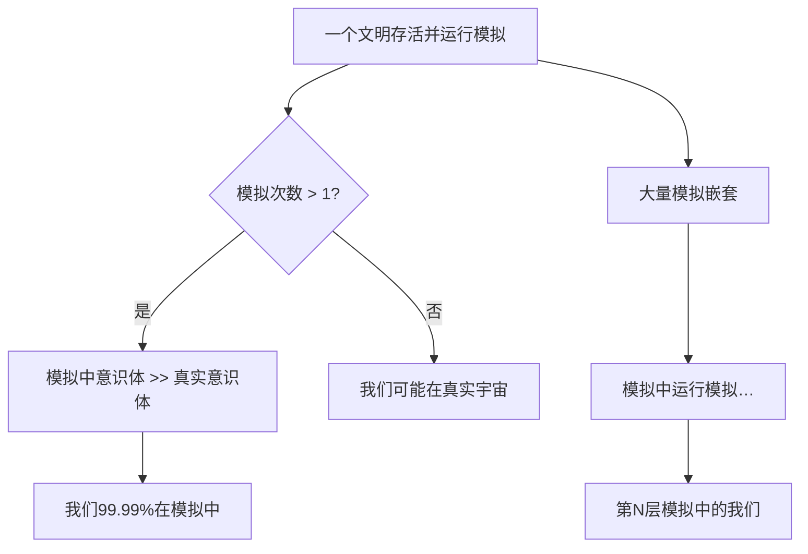

# 第51课：宇宙是模拟的？三大物理Bug解密

> *"我们生活在真实世界的概率不到十亿分之一。"* —— 埃隆·马斯克

---

## 🎯 本课目标

学完本课后，你将能够：

1. 复述模拟假说的核心逻辑和三大论证路径
2. 用量子叠加态、量子纠缠、物理常数极限解释"宇宙是程序"的物理证据
3. 分析宇宙参数的精密调校问题及其对随机演化论的挑战
4. 理解信息本质与暗物质作为"底层代码质量"的猜想
5. 评估嵌套模拟假说对意识、自由意志和文明意义的哲学冲击

**难度**：⭐⭐⭐ 进阶 | **预计学习时间**：35 分钟 | **前置课程**：第19课《技术奇点当AI超越人类》

---

## 一、核心命题：我们的宇宙是真实还是程序？

### 1.1 马斯克的挑战

2016年，马斯克在Code Conference上抛出一个震撼性问题：**"我们生活在基础现实中而非模拟中的概率，可能不到十亿分之一。"** 这不是科幻台词，而是基于一条冷酷的逻辑链：

```
50年前 → 游戏只有两个白色方块打乒乓球（Pong）
10年前 → 3A大作已能以假乱真
今天   → Sora的AI视频让人类无法分辨真假
50年后 → 虚拟世界的像素将和物理世界的光子无异
```

如果虚拟技术以这个速度进化，那么任何足够先进的文明必然产生"模拟祖先"的游戏或研究工具。如果这种模拟的数量远大于"真实世界"的数量，**我们更可能身处一个模拟之中**。

### 1.2 博斯特罗姆的三难困境

牛津大学哲学家尼克·博斯特罗姆（Nick Bostrom）在2003年发表的《你活在计算机模拟中吗？》论文中提出著名的**三难困境**。他认为以下三个命题中至少有一个为真：

| # | 命题 | 含义 |
|---|------|------|
| ① | **灭绝命题** | 所有文明在达到能运行大规模模拟的技术水平之前就自我毁灭了 |
| ② | **不感兴趣命题** | 技术文明对运行"祖先模拟"不感兴趣 |
| ③ | **模拟命题** | **我们几乎肯定生活在一个计算机模拟中** |

博斯特罗姆的分析逻辑：

> 如果命题①和②都不成立——也就是说，至少有一个文明存活下来并且对运行模拟感兴趣——那么模拟的"意识体"数量将远远超过"原始"意识体。从统计上看，任何一个给定的意识体都更可能身处模拟之中。



---

## 二、物理学三大"Bug"——模拟程序的证据

从软件工程角度看，我们的宇宙暴露出三个"设计缺陷"——它们太像程序的优化手段，而不像纯粹物理自然演化的结果。

### 2.1 Bug ①：量子叠加态 → 按需渲染（Lazy Rendering）

| 维度 | 物理现象 | 模拟逻辑 |
|------|----------|----------|
| **现象** | 粒子在未被观测时可同时存在于多个位置（叠加态） | 游戏引擎只渲染玩家视线范围内的场景 |
| **触发** | 一旦观测，波函数"坍缩"为单一确定状态 | 视锥体剪裁（Frustum Culling）：只在需要时渲染 |
| **类比** | 薛定谔的猫同时是死是活，直到你打开盒子 | 游戏中的门后没有内容，直到你推开门 |
| **证据** | 双缝实验：电子展现出波粒二象性，观测行为改变结果 | 系统为节省算力，仅在"需要知道时"才生成确定状态 |

```
游戏引擎的视锥剪裁逻辑：
if (player.lookingAt(object)):
    render(object, high_quality)
else:
    object.state = "indeterminate"  // 模糊状态，节省GPU

宇宙的量子逻辑：
if (observer.measuring(particle)):
    wavefunction.collapse()  // 坍缩为确定值
else:
    particle.state = "superposition"  // 叠加态，节省"算力"
```

### 2.2 Bug ②：量子纠缠 → 同一数据的两个快捷方式

量子纠缠是爱因斯坦称为"鬼魅般的超距作用"。两个纠缠粒子可以相隔250万光年（仙女座星系），改变其中一个的状态，另一个**瞬间**同步改变——远快于光速。

| 维度 | 物理现象 | 模拟逻辑 |
|------|----------|----------|
| **现象** | 两个纠缠粒子无论距离多远，状态瞬间同步 | 同一个文件的两个快捷方式（Shortcut） |
| **信息传递** | 看似超光速传输信息 | 底层代码中它们是**同一段数据** |
| **距离是假的** | 250万光年只是界面显示 | 在代码层级距离为零——同一内存地址 |
| **类比** | Alice打开桌面快捷方式修改文件，Bob的快捷方式立刻看到变化 | `ln -s /data/particle_x /user/alice/particle_x` |

```python
# 量子纠缠的"底层代码"假说
class QuantumEngine:
    def __init__(self):
        self.base_objects = {}  # 底层唯一实例
        self.shortcuts = {}     # 在宇宙各处的"快捷方式"
    
    def entangle(self, particle_a, particle_b):
        # 两个粒子指向同一底层对象
        base = BaseObject(id=uuid4())
        self.base_objects[base.id] = base
        self.shortcuts[particle_a] = base.id
        self.shortcuts[particle_b] = base.id
        # 无论两个"快捷方式"在界面上相隔多远
        # 底层都是同一个base对象
    
    def measure(self, particle):
        base = self.base_objects[self.shortcuts[particle]]
        return base.get_state()  # 任何位置的读取都返回同一值
```

### 2.3 Bug ③：物理常数极限 → CPU主频与最小像素

| 常数 | 物理意义 | 模拟类比 |
|------|----------|----------|
| **光速上限**（c ≈ 3×10⁸ m/s） | 任何物体无法超越光速 | **CPU主频上限**：处理器每秒最多处理N次操作。超频→系统崩溃 |
| **普朗克长度**（ℓₚ ≈ 1.6×10⁻³⁵ m） | 空间在此尺度下失去意义，是"最小长度" | **屏幕最小像素**：无法渲染比一个像素更小的细节 |
| **普朗克时间**（tₚ ≈ 5.4×10⁻⁴⁴ s） | 时间的"最小粒度"，更短的时间无物理意义 | **CPU时钟周期**：一个时钟周期是最短的操作单元 |
| **不确定性原理** | 位置和动量无法同时精确测量 | **浮点精度误差**：系统牺牲精度换速度 |

> **核心洞见**：在一个真实的连续宇宙中，没有理由存在"最小长度"或"最大速度"。这些硬性极限太像工程师为了**保证系统稳定性**而设的参数。

---

## 三、宇宙参数的精密调校——参数表

物理学家发现，如果宇宙的几个基本常数稍有偏差，星系、恒星、生命都将不复存在。

| 参数 | 当前值 | 若偏差千分之一 | 后果 |
|------|--------|---------------|------|
| **引力常数 G** | 6.674×10⁻¹¹ | 大 0.1% | 恒星燃烧过快，生命无时间演化 |
| **暗能量密度** | ~10⁻¹²²（普朗克单位） | 大 0.001% | 宇宙膨胀过快，无法形成星系 |
| **强核力强度** | 1（基准） | 小 2% | 质子无法结合→无原子核→无元素 |
| **电磁力/引力比** | ~10³⁶ | 稍变 | 恒星要么太冷（无聚变）要么太热（瞬间燃尽） |
| **碳-12共振能级** | 7.65 MeV | 偏移 0.1 MeV | 恒星无法稳定生成碳→无碳基生命 |
| **质子/中子质量比** | 1.001378 | 稍变 | 核聚变链条断裂→宇宙只有氢 |

同时，地球环境的"巧合"也令人震惊：

| 环境因素 | 数值 | 意义 |
|----------|------|------|
| 地轴倾角 | 23.5° | 太小→无四季；太大→极端气候 |
| 月球-地球质量比 | 1:81 | 稳定地轴，防止翻转（太阳系最大卫星/行星比） |
| 木星位置 | 5.2 AU | "宇宙吸尘器"——挡下大量彗星撞击 |
| 地球与太阳距离 | 1 AU | 宜居带中心——水同时以三态存在 |

普林斯顿大学2024年的超算模拟实验：仅输入4个基础参数（引力、电磁力、强核力、暗能量密度），迷你宇宙**自发演化出星系结构和类生命化学迹象**——仿佛宇宙的"种子参数"就是为生成复杂结构而设计的。

---

## 四、信息本质与暗物质——95%宇宙是底层代码？

### 4.1 沃普森的"信息热力学第二定律"

英国物理学家梅尔文·沃普森（Melvin Vopson）提出了**信息物理学的惊人假说**：

| 传统认知 | 沃普森的发现 |
|----------|------------|
| 热力学第二定律：熵总是增加 → 宇宙趋于无序 | 病毒基因突变后，**信息熵反而减少**——信息结构更有序 |
| 信息是物理的副产品 | **信息可能比物质更基础**——质能是信息的载体 |
| 宇宙是物质+能量的组合 | 宇宙可能是信息+物质+能量的**三元结构** |

### 4.2 暗物质新解

| 概念 | 传统解释 | 模拟假说解释 |
|------|----------|------------|
| **暗物质**（占宇宙27%） | 未知粒子（WIMP/轴子），从未探测到 | 运行模拟所需的**底层代码**和**加载机制**的质量总和 |
| **暗能量**（占宇宙68%） | 推动宇宙加速膨胀的神秘能量 | 模拟程序运行所占用的**CPU周期**和**内存分配** |
| **普通物质**（仅5%） | 我们能看到的恒星、行星、我们自身 | 模拟中**渲染给"玩家"可见的内容** |

> 模拟假说完美解释了物理学最大的尴尬——**我们研究了100年，却对宇宙95%的"东西"一无所知**。因为它们不是"东西"，是代码。

---

## 五、嵌套模拟与意识的哲学冲击

### 5.1 37层嵌套假说

| 层级 | 身份 | 说明 |
|------|------|------|
| 第0层 | "真实"宇宙 | 可能早已不存在，或无法抵达 |
| 第1层 | 模拟宇宙 | 某个高级文明运行的第一次模拟 |
| ... | ... | 每一层模拟都运行更高一层的模拟 |
| **第37层** | **我们？** | 模拟中的模拟中的模拟……中的模拟 |
| 第38层 | 我们将创造的模拟 | 50年后我们也会运行"祖先模拟" |

**递归逻辑**：如果我们自己能在50年内模拟宇宙，那么我们的"上层"一定也能——每一个被模拟的文明都将创造出自己的模拟，导致**无限嵌套**。

### 5.2 意识——程序的Bug还是目标？

```
三种立场：

立场A（悲观）：
  意识是模拟的意外——等同于"stack overflow"。
  我们的意义为0，只是代码中的浮点误差。

立场B（中性）：
  意识是模拟的预期产物——程序的目标就是观察"意识如何出现"。
  我们是系统中的一个功能性变量。

立场C（反叛）：
  即便宇宙是模拟的，我们的痛苦、喜悦、爱与思考仍然是真实的。
  程序中的Bug = 觉醒的证明。
  意识到自己在模拟中，本身就是对程序的"反叛"。
```

> **"我思故我在"的21世纪版本**：即便世界是代码构成的，怀疑本身必须是真实的——因为模拟可以生成虚假的物理世界，但无法生成"我在怀疑"这一事实。

---

## 六、反对意见与科学边界

| 反对论点 | 核心论证 | 弱点 |
|----------|----------|------|
| **不可证伪** | 模拟假说无法被实验证伪——不是科学 | 博斯特罗姆：可以——如果发现"程序员留下的后门"或代码错误 |
| **无限回归** | 如果宇宙是模拟，那上层宇宙也是模拟……无限嵌套无尽头 | 不影响概率计算：只要有一个"基座"真实世界，上层都是模拟 |
| **奥卡姆剃刀** | 增加"造模拟者"使解释更复杂 | 反驳：单一"物理定律演化一切"的随机性比"参数调校"更不简约 |
| **人类中心主义** | 宇宙的精密调校是后见之明偏见 | 但常数偏差千分之一就无生命的计算结果是**独立验证**的 |

---

## 🎯 深度学习与进阶练习

### 练习一：计算题——模拟分辨率

已知可观测宇宙直径约 930 亿光年（8.8×10²⁶ 米），普朗克长度 1.6×10⁻³⁵ 米。

> 如果把宇宙看作一个三维体素（voxel）渲染空间，每个"体素"单位为一个普朗克长度，计算这个宇宙需要多少个"体素"？

<details>
<summary>✏️ 点击查看答案</summary>

计算：宇宙边长 ≈ 8.8×10²⁶ / 1.6×10⁻³⁵ ≈ 5.5×10⁶¹ 个普朗克长度

三维体素总数 = (5.5×10⁶¹)³ ≈ **1.66×10¹⁸⁵ 个体素**

对比：全球所有数据中心的存储总和约 10²² 字节。

结论：如果宇宙是模拟，其"分辨率"远超出人类技术可想象的范畴——但如果"上层"比我们早演化了100亿年呢？
</details>

---

### 练习二：分析题——模拟瑕疵检测

设想你是一名"宇宙QA工程师"。列出**三个你会在宇宙中寻找的"渲染瑕疵"**，解释为什么这些现象可能暴露模拟的本质。

<details>
<summary>✏️ 点击查看参考思路</summary>

1. **离散效应**：在极高能粒子碰撞中观察空间是否"像素化"。如果普朗克尺度确实是"最小像素"，在足够高的能量下应该能检测到空间的"网格"效应。

2. **粒子纠缠的延迟异常**：如果纠缠粒子本质是同一内存地址的"指针"，那么在极高精度的时间测量中，是否会出现一个粒子"更新"后，另一个粒子有极短暂的"响应延迟"——模拟器的同步帧间隔。

3. **复数系统的精度截断**：量子力学中的概率振幅是复数。如果模拟有精度上限，极其复杂的量子系统（如蛋白质折叠）可能出现"四舍五入误差"的统计异常。

4. **星系红移的量级跳跃**：如果暗能量="内存分配"，那么宇宙膨胀的速率可能在某个"分配边界"附近出现反常——类似程序日志中的内存警告。
</details>

---

### 练习三：案例迁移——将康波周期与模拟假说交叉分析

康波周期理论认为经济存在 50-60 年的长周期。如果宇宙是模拟的，请分析：

> 经济周期的存在，是否可以被理解为"模拟程序的资源调度策略"？尝试将经济衰退类比为操作系统的某种机制。

<details>
<summary>✏️ 点击查看答案</summary>

**类比：康波衰退 = 模拟系统的垃圾回收（Garbage Collection, GC）**

| 概念 | 操作系统 | 模拟宇宙 |
|------|----------|----------|
| 内存分配 | 程序不断申请内存 | 经济增长期：不断产生新"实体"（公司/资产/交易） |
| 内存碎片 | 大量小对象导致效率下降 | 金融衍生品复杂化、资产泡沫、过度杠杆 |
| GC暂停（Stop-the-World） | 系统暂停所有线程清理内存 | 经济衰退/金融危机：市场冻结、资产减记、"创造性破坏" |
| GC结果 | 释放无用内存，程序恢复运行 | 淘汰低效企业，释放资源给新创新——新一轮康波上升 |

**深入问题**：如果这个类比成立，那么试图"消除经济周期"就像试图消除操作系统的GC——短期内看起来更流畅，但长期会导致系统崩溃（日本"失去的三十年"可视为长GC暂停后的僵化状态）。
</details>

---

### 练习四：判断辨析——哪些是模拟假说的有效论证？

以下五个陈述，判断哪些是**有效**论证、哪些是**伪论证**或逻辑谬误：

1. "宇宙存在数学定律，而数学是人类发明的抽象系统→宇宙是人类创造的模拟。"
2. "光速不可超越，就像CPU主频限制一样，这是模拟假说的有力证据。"
3. "因为宇宙的95%是暗物质和暗能量，而我们看不见它们，所以它们一定是'代码'。"
4. "我们已经在实验室创造了微型量子模拟——如果技术持续进步，我们最终将创造宇宙级模拟。如果我们能做到，那么已经有人做到了。"
5. "我有时候觉得这个世界太奇怪了，一定是假的。"

<details>
<summary>✏️ 点击查看答案</summary>

| # | 判断 | 分析 |
|---|------|------|
| 1 | ❌ 伪论证 | 混淆了"描述"和"创造"。数学是人类**描述**宇宙的工具，不代表宇宙本身就是数学的产物。就像温度计测量温度，不代表温度计创造了温度。 |
| 2 | ⚠️ 弱论证 | 有启发性但不能证明——类比不是证据。光速有限也可以从狭义相对论推导出来，不需要"程序员设定"。这是"与……一致"而非"证明"。 |
| 3 | ❌ 伪论证 | 犯了"无知论证"（Argument from Ignorance）谬误——"我们不知道它是什么，所以它一定是我猜的东西。" 暗物质可能是未被发现的粒子，不能直接等同于代码。 |
| 4 | ✅ 有效论证 | 这是博斯特罗姆三难困境的核心——技术进步的必然性推论。如果我们正在向这个方向前进，那么其他文明（如果存在）也必然如此。 |
| 5 | ❌ 伪论证 | 主观感受不能作为客观证据。这种"觉得奇怪"的感觉可以用认知心理学（如Derealization/去现实感）解释。 |
</details>

---

### 练习五：综合思考——你的立场

如果你必须在博斯特罗姆三难困境的三个命题中选择一个最可能为真的，你会选哪一个？请写出一段 150 字以内的论证，说明你的选择和理由。

<details>
<summary>✏️ 点击查看参考</summary>

这道题没有标准答案——博斯特罗姆本人也承认三个命题都令人不安。

- 选**①（灭绝命题）**：意味着人类文明几乎没有机会在技术奇点后存活。费米悖论（"他们在哪里？"）的答案可能是"他们都死了"。
- 选**②（不感兴趣命题）**：意味着宇宙中可能充满超级文明，但他们都对"模拟祖先"毫无兴趣——这似乎违背我们对探索欲的理解。
- 选**③（模拟命题）**：意味着我们活在程序中——但这不改变我们感受的真实性。就像游戏角色不会因为知道自己由代码构成而觉得"爱"不够真实。

**博斯特罗姆私人倾向**：他认为三个命题的概率大致均等——各约 **1/3**。但他承认，如果非要选一个，命题①（灭绝）稍微领先——因为大过滤器（Great Filter）的存在。
</details>

---

## 📊 知识连接

| 类型 | 课程 | 关联点 |
|------|------|--------|
| **前置** | 第19课《技术奇点当AI超越人类》 | 技术进步速度是模拟假说的核心变量——我们正以指数级接近"运行模拟"的能力 |
| **前置** | 第06课《投资操作手册》 | 费米悖论与大过滤器——为何我们看不到外星文明？也许他们都在模拟中 |
| **关联** | 第14课《现代货币理论MMT》 | 如果宇宙是模拟，"价值"本身也只是一个变量——货币是模拟中的模拟 |
| **关联** | 第44课《全球宏观经济指标》 | 经济数据的"异常"是否可能是模拟参数的调整痕迹？ |
| **后续** | 未来课程（意识经济学） | 如果意识是模拟的目标，那么"注意力"就是宇宙最稀缺的资源 |

---

## 📖 推荐阅读

| 作者 | 著作 | 核心观点 | 难度 |
|------|------|----------|------|
| 尼克·博斯特罗姆 | *Superintelligence* (2014) | 技术奇点与存在风险——模拟文明的上层可能如何运作 | ⭐⭐⭐⭐ |
| 大卫·查尔默斯 | *Reality+* (2022) | 即使宇宙是虚拟的，生活仍然有意义——虚拟现实主义 | ⭐⭐⭐ |
| 迈克斯·泰格马克 | *Our Mathematical Universe* (2014) | 宇宙不是"被数学描述"——宇宙**就是**数学结构 | ⭐⭐⭐⭐ |
| 唐纳德·霍夫曼 | *The Case Against Reality* (2019) | 进化让我们看到"界面"而非"真相"——认知的模拟假说 | ⭐⭐⭐ |
| 卡洛·罗韦利 | *Reality Is Not What It Seems* (2014) | 量子引力与时空的涌现性——无时空的底层代码假说 | ⭐⭐⭐⭐ |

---

## 🌐 下一课预告

**第52课：文明演化的能量阶梯**

从卡尔达肖夫指数到戴森球——为什么能源获取能力决定了文明的等级？模拟假说中的"上层文明"需要什么样的能量来运行宇宙级模拟？

---

*本课完成于 2026年 | 内容基于：博斯特罗姆模拟假说（2003）、沃普森信息物理学（2023）、普林斯顿迷你宇宙模拟（2024）*
